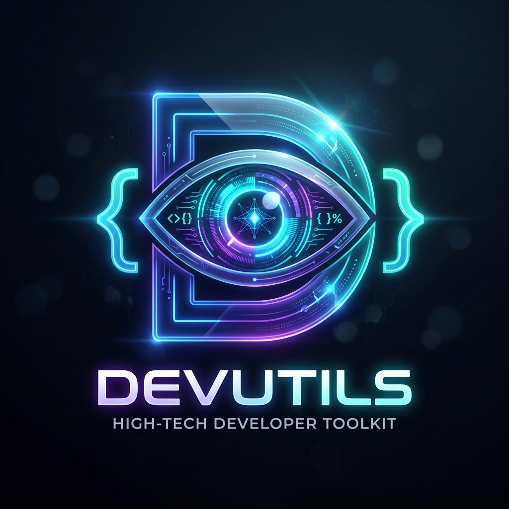

# 🚀 DevUtils: The Industrial-Grade AI Developer Engine



> **The first autonomous developer toolkit that doesn't just guess—it reasons.**

DevUtils is a State-of-the-Art (SOTA) autonomous Rust agent designed to bridge the gap between "AI Chat" and "Production Code." While other tools hallucinate, DevUtils **Plan-Act-Observes** and **Verifies** every change in a real-time semantic sandbox.

---

## 🔥 Why it's SOTA (2026 Edition)

DevUtils isn't just a collection of scripts; it's a unified intelligence layer for your terminal:

*   **🤖 Truly Autonomous Agent**: Powered by a 12-workflow parallel engine. It builds, tests, catches errors, and self-corrects until the task is **Verified 100%**.
*   **🧠 Local Semantic RAG**: Uses `fastembed` with high-density vector embeddings to understand your entire repository's context—not just the file you're in.
*   **⚡ Parallel Performance**: Built in high-concurrency Rust with `tokio` and `rayon`. Search, build, and test at the physical speed of your hardware.
*   **🏗️ AST-Aware Context**: Uses `tree-sitter` to parse your code's structure (functions, structs, impls) to give the AI a deep architectural map.
*   **🔌 Enterprise-Ready Plugin System**: 100+ community plugins plus a marketplace for custom developer workflows.

---

## 🛠️ Quick Start

### 1. Installation
```bash
cargo install devutils
```

### 2. Configure your AI
```bash
# Add your API key (Gemini, OpenAI, or local Ollama)
export GEMINI_API_KEY="your-key-here"
```

### 3. Deploy the Agent
```bash
# Hand off a complex task
devutils agent "Migrate our auth system to JWT and add unit tests"
```

---

## 🖥️ The Interface

DevUtils features a **Premium Interactive TUI** (lazygit-style) that brings your terminal to life. Monitor agents in real-time, browse semantic search results, and manage your plugins with zero context switching.

---

## 💎 Core Workflows

### 🔍 Semantic Search
Stop searching for strings. Search for **intent**.
`devutils search "how do we handle database migrations?"`

### 🛠️ Auto-Fix (CI Bridge)
Integrate DevUtils into your CI. When a build fails, the agent automatically:
1.  Parses the logs.
2.  Locates the bug.
3.  Proposes a verified fix.
4.  Submits a PR.

### 🧪 Forensic Bug Hunter
Deep property-based testing. DevUtils generates real `proptest` harnesses to find edge cases you never thought of.

---

## 🤝 Contributing & Viral Community
We're building the future of autonomous development. Join the **DevUtils Marketplace** or help us harden the agent engine.

**Star the repo if you're tired of manual developer workflows! ⭐**

---

[Documentation](README.md) | [Installation Guide](INSTALL.md) | [AI Agent Workflows](src/ultimate_agent.rs) | [Plugin Marketplace](plugins/README.md)
